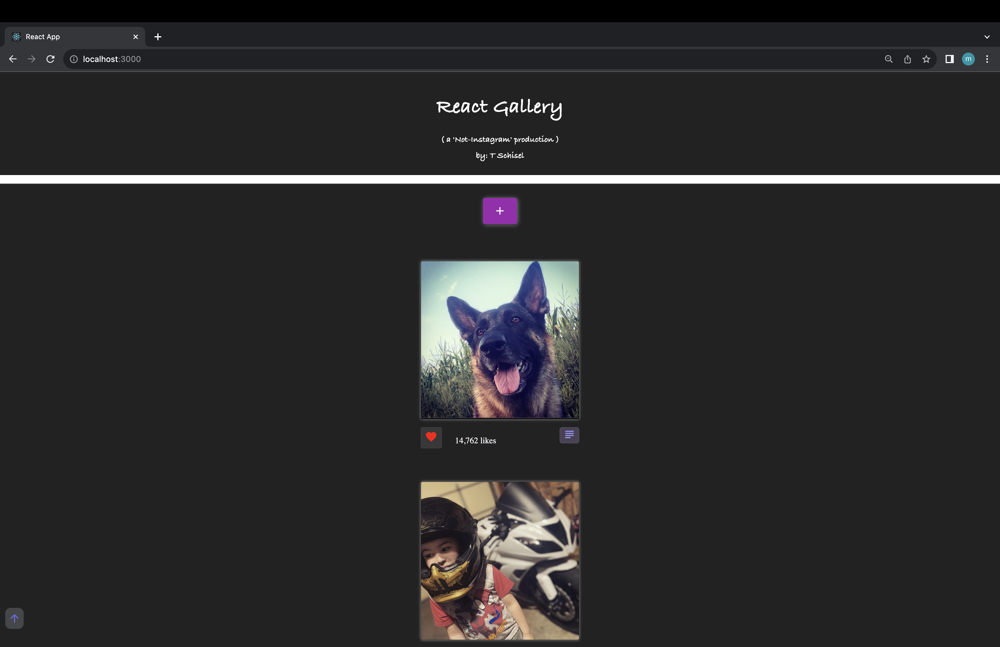

# Project Name

"React Gallery" by T Mark Schisel

## Description

For this project, the requirements were:

"Create a gallery page to share pictures of things that are important to you. Visitors can click on an image to see a description and use a button to "like" an image."

To practice passing values through `props` in React, I built the gallery using mulitple components - an `App`, `GalleryList`, and `GalleryItem`.

- `App` - represents the overall application or site 
- `GalleryList` - represents the gallery of images. 
- `GalleryItem` - represents a single image in the gallery with the ability to click the image to toggle between image and description as well as the ability to like an image.

## Screenshot



## Technologies Used
- React
- JavaScript
- HTML
- CSS
- Node.js
- PostgreSQL
- React.js
- PG 

For additional styling, 
    - Material UI
    - SweetAlerts
    - Multer

## Application Instructions

Due to its inline-styling, this application was designed to be viewed on a smaller size screen, or window in browser. Viewing on a full size window may result in wide unused space on each side of images.  More design to come!

Please review the database.sql file for information on how to create a database for this application.

###### HOW TO USE: ######

### Setup

There is no database component to base mode. All data is stored in an array on the server. Before you get started, add a few images to the `public/images` folder and modify the `server/modules/data.js` to include an `id`, `title`, `description` and `path for` each of your images. Each `id` should be a unique number (e.g. 1, 2, 3...).

Running the server code requires `nodemon`. If you don't already have `nodemon`, install it globally with `npm install nodemon --global`.

```
npm install
npm run server
```

Now that the server is running, open a new terminal tab with `cmd + t` and start the react client app.

```
npm run client
```

- To view image description, click either the image itself, or the button below, located to the bottom right of the image.
    - On click, will reveal a red delete button. pressing this will delete the corresponding image from the page, and database.


## Problems solved
- toggling between images and descriptions
- learning about the many different options for styling Apps, i.e. multer, sweet alerts, material UI, etc.
- React syntax, and navigation
- review of SQL database protocols, and operation
- using Postman for testing, need to review

## Additional Goals to be completed in the near future:
- [] make an edit button that allows description to be modified
- [] make a comment button that can add comments/view
- [x] back to the top button?
- [] side menu?